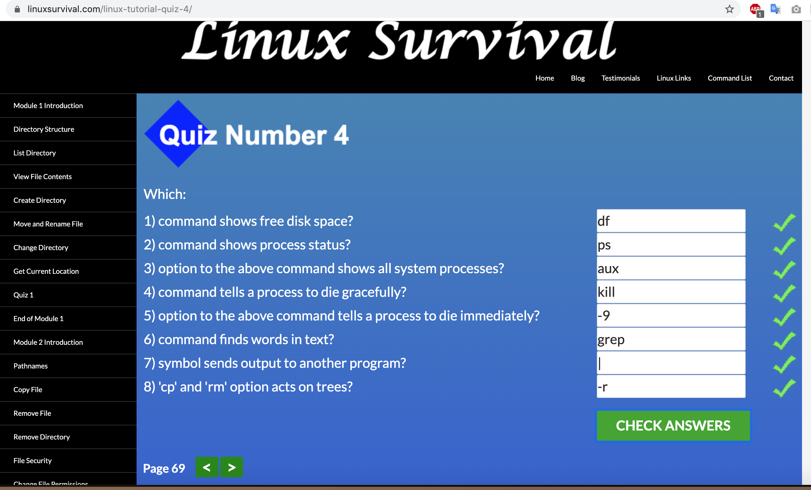
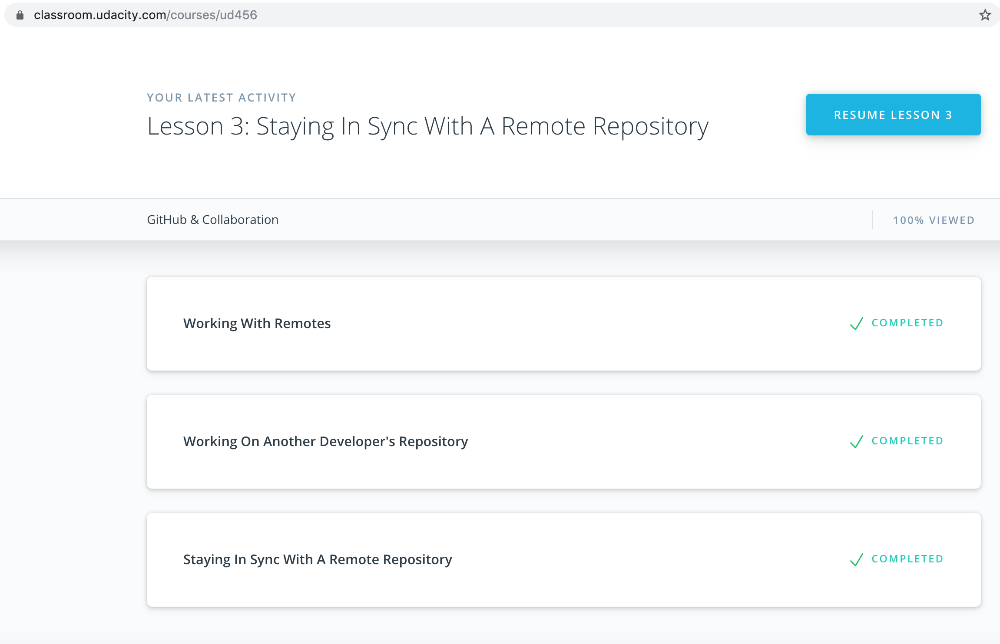
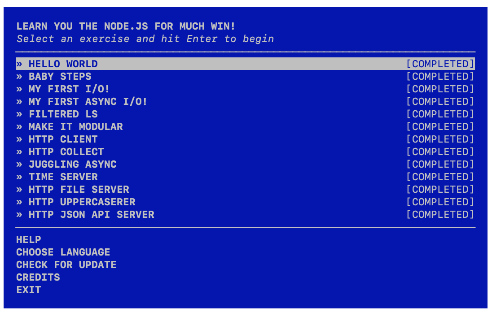
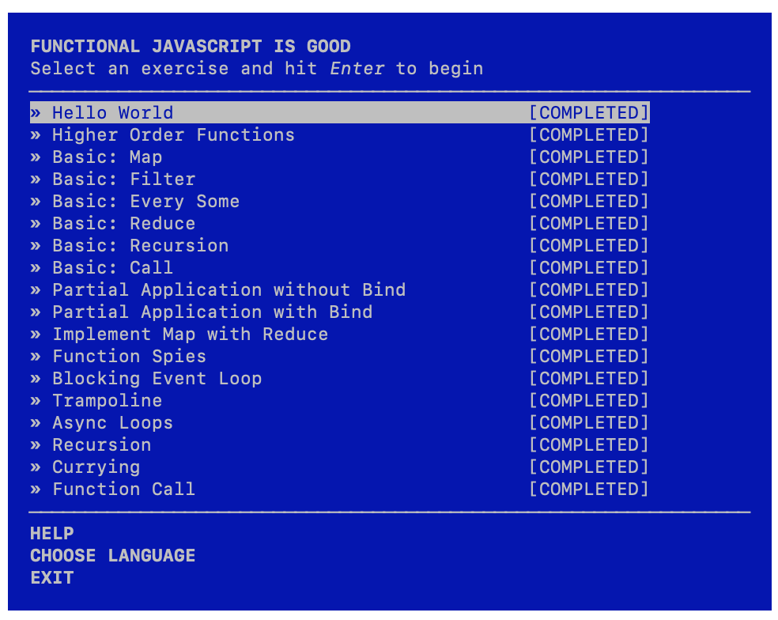
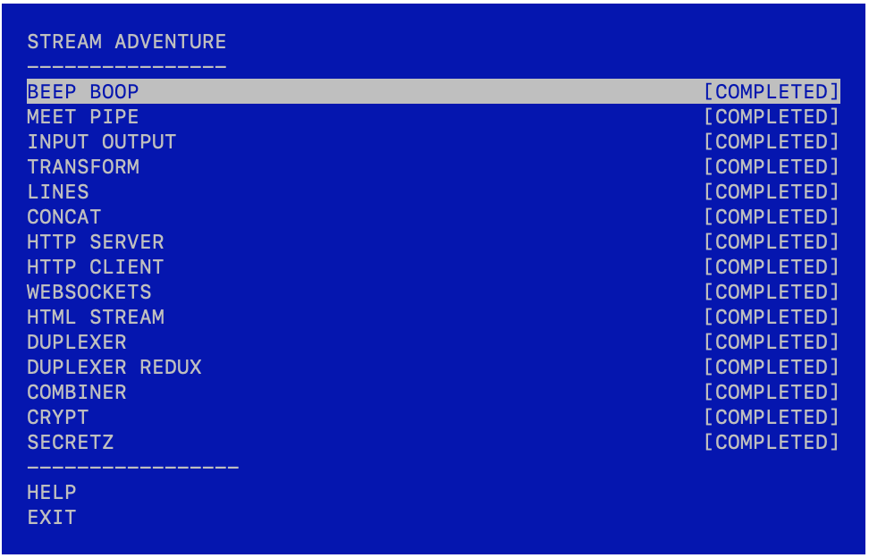
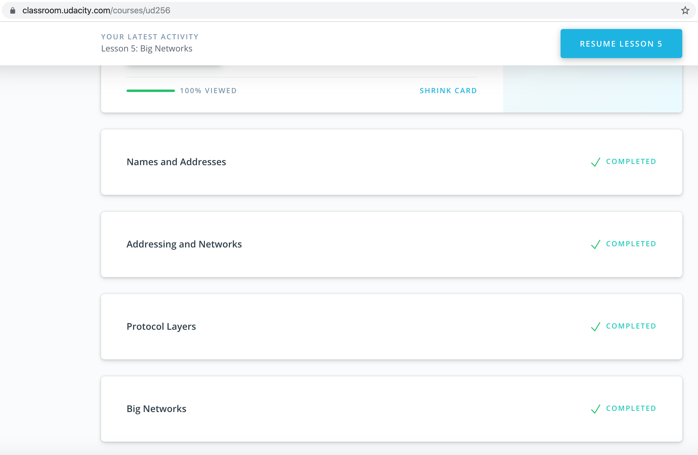
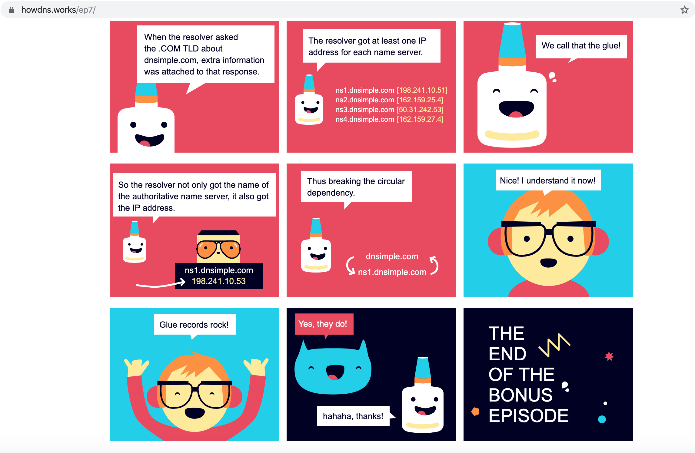

# kottans-backend
## Git and GitHub
I was impressed with easy way of providing information of Git in Udacity course.

## Unix Shell



1. ~ shortcut
2. Linux has a spelling checker
3. grep with pipeline

## Git Collaboration




1. purpose of git fetch
2. power of git rebase
3. git fetch

## NodeJS Basics 1





1. Second and third workshops
2. How we can scoff at anything using prototype
3. Pipes

## Memory Management

1. 
	`- What's going to happen if program reaches maximum limit of stack ?`

	If the maximum stack size has been reached, we have a stack overflow and the program receives a Segmentation Fault.


	`- What's going to happen if program requests a big (more then 128KB) memory allocation on heap ?`

	If there is enough space in the heap to satisfy a memory request, it can be handled by the language runtime without kernel involvement. Otherwise the heap is enlarged via the brk() system call (implementation) to make room for the requested block. 


	`- What's the difference between Text and Data memory segments ?`

	The data segment holds the contents for static variables initialized in source code.The string lives in the text segment, which is read-only and stores all of your code in addition to tidbits like string literals. 


2.
```md
==== regions for process 2489  (non-writable and writable regions are interleaved)
REGION TYPE                      START - END             [ VSIZE  RSDNT  DIRTY   SWAP] PRT/MAX SHRMOD PURGE    REGION DETAIL
__TEXT                 000000010a4b1000-000000010a4b8000 [     7      7      0      0] r-x/rwx SM=COW          /Applications/Docker.app/Contents/Resources/bin/docker-compose
__DATA                 000000010a4b8000-000000010a4bd000 [     5      0      0      2] rw-/rwx SM=COW          /Applications/Docker.app/Contents/Resources/bin/docker-compose
__LINKEDIT             000000010a4bd000-000000010ad93000 [  2262   2103      0      0] r--/rwx SM=COW          /Applications/Docker.app/Contents/Resources/bin/docker-compose
Kernel Alloc Once      000000010ad93000-000000010ad95000 [     2      0      0      1] rw-/rwx SM=PRV          
MALLOC metadata        000000010ad95000-000000010ad96000 [     1      1      1      0] r--/rwx SM=COW          DefaultMallocZone_0x10ad95000 zone structure
MALLOC metadata        000000010ad96000-000000010ad97000 [     1      1      1      0] rw-/rwx SM=COW          
MALLOC guard page      000000010ad97000-000000010ad98000 [     1      0      0      0] ---/rwx SM=COW          
MALLOC metadata        000000010ad98000-000000010ad9e000 [     6      5      5      1] rw-/rwx SM=COW          
MALLOC guard page      000000010ad9e000-000000010ad9f000 [     1      0      0      0] ---/rwx SM=COW          
MALLOC guard page      000000010ad9f000-000000010ada0000 [     1      0      0      0] ---/rwx SM=NUL          
MALLOC metadata        000000010ada0000-000000010ada6000 [     6      4      4      2] rw-/rwx SM=COW          
MALLOC guard page      000000010ada6000-000000010ada7000 [     1      0      0      0] ---/rwx SM=NUL          
MALLOC metadata        000000010ada7000-000000010ada8000 [     1      1      1      0] r--/rwx SM=COW          
MALLOC_LARGE (empty)   000000010ada8000-000000010aeb8000 [   272      0      0    272] rw-/rwx SM=COW          
MALLOC_LARGE metadata  000000010aeb8000-000000010aeb9000 [     1      1      1      0] rw-/rwx SM=COW          DefaultMallocZone_0x10ad95000
MALLOC_LARGE (empty)   000000010aeb9000-000000010b802000 [  2377      0      0   2377] rw-/rwx SM=COW          
__TEXT                 0000000112df4000-0000000112e5f000 [   107    107      0      0] r-x/rwx SM=COW          /usr/lib/dyld
__DATA                 0000000112e5f000-0000000112e64000 [     5      2      2      3] rw-/rwx SM=COW          /usr/lib/dyld
__DATA                 0000000112e64000-0000000112e98000 [    52      1      1      7] rw-/rwx SM=PRV          /usr/lib/dyld
__LINKEDIT             0000000112e98000-0000000112ebf000 [    39     39      0      0] r--/rwx SM=COW          /usr/lib/dyld
MALLOC_TINY            00007fcef5c00000-00007fcef5d00000 [   256      3      3      2] rw-/rwx SM=COW          DefaultMallocZone_0x10ad95000
MALLOC_TINY (empty)    00007fcef5d00000-00007fcef5f00000 [   512      4      4      2] rw-/rwx SM=COW          DefaultMallocZone_0x10ad95000
MALLOC_TINY            00007fcef5f00000-00007fcef6000000 [   256      1      1      2] rw-/rwx SM=COW          DefaultMallocZone_0x10ad95000
MALLOC_SMALL           00007fcef6000000-00007fcef6800000 [  2048      1      1     25] rw-/rwx SM=COW          DefaultMallocZone_0x10ad95000
MALLOC_SMALL (empty)   00007fcef6800000-00007fcef7800000 [  4096      2      2     33] rw-/rwx SM=COW          DefaultMallocZone_0x10ad95000
STACK GUARD            00007ffee174f000-00007ffee4f4f000 [ 14336      0      0      0] ---/rwx SM=NUL          stack guard for thread 0
Stack                  00007ffee4f4f000-00007ffee574f000 [  2048      1      1      3] rw-/rwx SM=PRV          thread 0

```


*Memory Mapping Segment, Heap and Stack fragments address:*
- `HEAP - 000000010aeb9000-000000010b802000`
- `STACK - 00007ffee4f4f000-00007ffee574f000`
- `MMS - 0000000112df4000-0000000112e5f000`

3.
	1. How virtual memory is structured.
	2. We can use built-in utilities to see virtual memory segments of particular process.
	3. Garbage collectors working principals.


## TCP. UDP. Network





1. How internet is constructed.
2. The transfer of information through the internet.
3. dns and net libs

## Http & Https

*Requests:*
- `curl https://api.github.com/users/assmass13`
- `curl -i https://api.github.com/users/assmass13`
- `curl --user "assmass13:*********" https://api.github.com/gists/starred`
- `curl --user "assmass13" https://api.github.com/gists/starred`
- `curl -i https://api.github.com/orgs/kottans/repos`
- `curl -H 'Authorization: *********' https://api.github.com/repos/assmass13/kottans-backend/issues -d '{"title": "Issue for HTTP/HTTPS task"}'`

1. `- Name at least three possible negative consequences of not using https.`

	Due of lack of encryption your data can be intercepted, then it can be read or modified. Also https assures you that you talk with verified source(not phishing website).


2. `- Explain the main idea behind public key cryptography in few sentences.`

	If you need to send data securely, you can use asymetric keys. Encrypt data with receiver's public key, therefore it can be decrypted only with related private key which only end user has.


3. `- You are creating and application for pet clinic. You need to implement the following functionality:`

	1. Request: `POST /pets {'name': string, 'age': int, 'breed': string, 'ownerName': string, 'medicalHistory': [string, ...]}`

	   Response: `201 {'id': int, 'name': string, 'age': int, 'breed': string, 'ownerName': string, 'medicalHistory': [string, ...]}`


	2. Request: `GET /pets?name=string` 

	   Response: `200 [{'id': int, 'name': string, 'age': int, 'breed': string, 'ownerName': string, 'medicalHistory': string}, ...]`


	3. Request: `PATCH /pets/<pet_id:int> {'name': string}`

	   Response: `200 {'id': int, 'name': string, 'age': int, 'breed': string, 'ownerName': string, 'medicalHistory': [string, ...]}`


	4. Request: `PATCH /pets/<pet_id:int> {'medicalHistory': [string, ...]}`

	   Response: `200 {'id': int, 'name': string, 'age': int, 'breed': string, 'ownerName': string, 'medicalHistory': [string, ...]}`


	5. Request: `PATCH /doctors/<doctor_id:int> {'assignedPets': [int, ...]}`

	   Response: `200 {'id': int, 'name': string, ..., 'assignedPets': [int, ...]}`


	6. Request: `POST /appointments {'petId': int, 'doctorId': int, 'startDateTime': string(date), 'endDateTime': string(date), 'description': string}`

	   Response: `201 {'id': int, 'petId': int, 'doctorId': int, 'startDateTime': string(date), 'endDateTime': string(date), 'description': string}`


