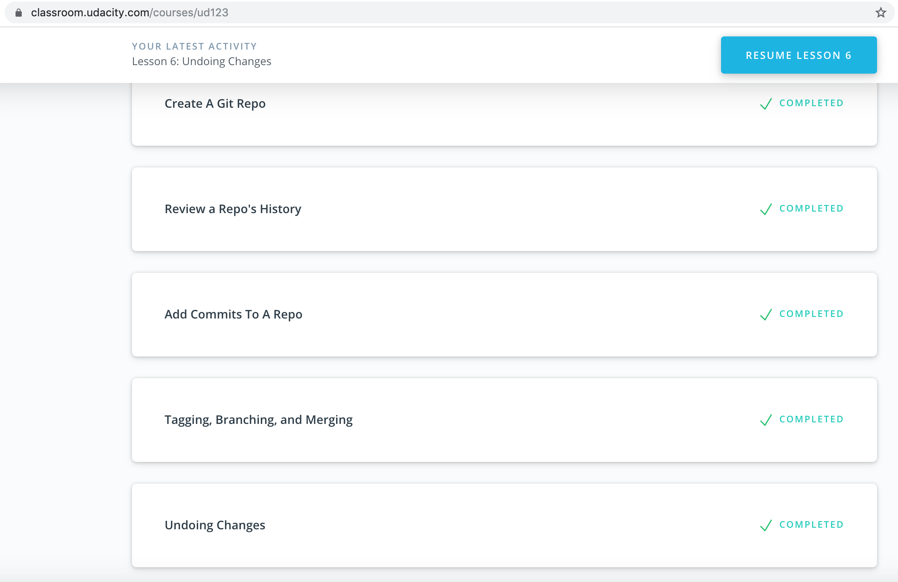

# kottans-backend
## Git and GitHub
I was impressed with easy way of providing information of Git in Udacity course.

## Unix Shell

1. ~ shortcut
2. Linux has a spelling checker
3. grep with pipeline
